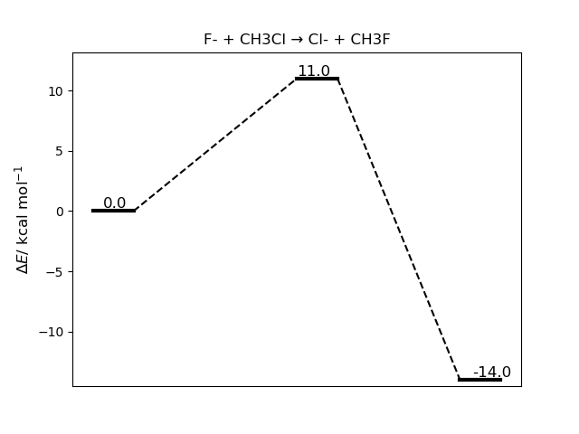

# Examples

## 1. SN2 Reaction (sn2.py)
Considering the SN2 reaction between F- and methyl chloride we have the
smiles strings for the reactant and products generated from Chemdraw:

flouride        : \[F-]

methyl_chloride : \[H]C(\[H])(Cl)\[H]

chloride        : \[Cl-]

methyl_flouride : \[H]C(\[H])(F)\[H]


### 1.1 Setting paths and number of cores
The paths to ORCA and XTB executables are set with

```
Config.path_to_orca = '/usr/local/orca_4_1_1/orca'
Config.path_to_xtb = '/usr/local/xtb/bin/xtb'
```

and the number of cores for ORCA to use with

```
Config.n_cores = 4
```


### 1.2 Initialising Reactants and Products
Reactant and product objects are initialised from by giving names and
SMILES strings e.g.

```
flouride = Reactant(name='F-', smiles='[F-]', solvent='water')
```

Here a solvent model is also specified, but this may be left empty for
reactions in the gas phase.

### 1.3 Initialising a Reaction
Creating a reaction using the _Reactant_ and _Product_ objects requires

```
reaction = Reaction(flouride, methyl_chloride, chloride, methyl_flouride)
```

### 1.4 Calculating the reaction profile
The energy profile for the reaction can be calculated by calling
_calculate_reaction_profile()_ i.e.

```
reaction.calculate_reaction_profile()
```

This function call will return a plot something like:



Where conformers of the reactant and products have been searched and the
profile calculated at PBE0-D3BJ/def2-TZVP//PBE0-D3BJ/def2-SVP. It should
take around 10 minutes to complete on a modern processor.
